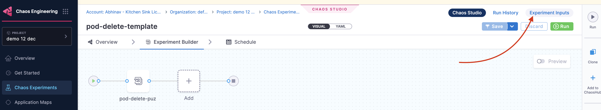

This topic describes how you can use runtime variables in chaos experiments.

Harness Chaos Engineering (CE) supports runtime variables when executing chaos experiments. By using runtime inputs, Harness dynamically constructs input fields for various tunables. These values are then passed to the chaos experiment during execution.

## Create and Run Experiments
Chaos experiments can be executed using either static values or dynamic runtime values. 
- **Static variables**: Define them directly in the experiment and use them without any modification.
- **Runtime variables**: Specify them using `<+input>`, allowing customization at [runtime](#using-runtime-variables) or through [saved input sets](#using-pre-defined-input-sets). 

### Using runtime variables

This section explains how to configure and run experiments with runtime inputs.

To set up an experiment, specify details such as the name, environment, infrastructure, and fault name. In the **Target Application** and **Tune Fault** modals, set the tunables as **Runtime Input** and **Save** the changes.

    

:::tip
- If you don't provide values for certain fields (which are not mandatory), the experiment executes with default values.
- Variables specified as runtime inputs appear as editable fields in the UI, whereas static fields appear as display-only.
:::

### Using pre-defined input sets

Pre-defined input sets allow you to store common runtime variables and values for reuse. These input sets are versioned to prevent breaking changes. Here’s how you can create and use them:

1. Go to **Experiment Inputs**.

    

2. Select **+ New Input Set**.

    

3. Specify the inputs and click **Save**.

    

By using runtime variables and input sets, you can make your chaos experiments more flexible, reusable, and efficient. This approach ensures that experiments are not only dynamic but also easier to manage and maintain over time.

